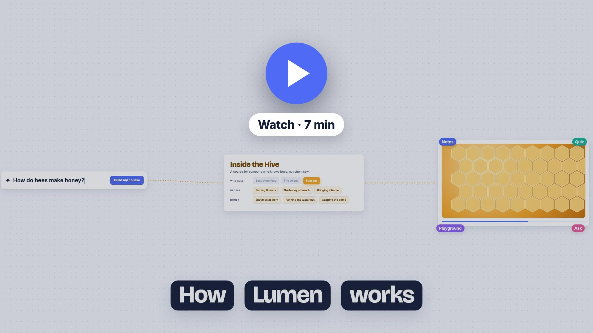

# Lumen

Name any topic. A quick knowledge check finds where you are, a personal course maps out the path, and every
lesson becomes an animated, narrated explainer with notes, a quiz and a playground.

**Stack:** Next.js 16 · assistant-ui · shadcn/ui (Base UI) · Mastra workflows · OpenRouter (GPT-6.1 Sol) · ElevenLabs · GSAP · three.js · SQLite

## Watch: how Lumen works

[](https://github.com/Quintui/education-app/raw/main/docs/how-lumen-works.mp4)

*Click the image to download the MP4 (39 MB, 1080p).*

A 7-minute narrated explainer of the whole app: the three layers, streaming to the screen, the knowledge check,
the course tree, and every step of the lesson workflow, from plan to narration, animation, assembly and playback.

It was made the way Lumen makes its lessons. The script and scenes were written by hand (with Claude Code)
for Lumen's own stage kit, narrated through the app's ElevenLabs code with `[[cue]]` timing, and rendered frame
by frame from the same stage page the lesson player uses.

## Setup

```bash
cp .env.example .env.local   # add OPENROUTER_API_KEY and ELEVENLABS_API_KEY (or LUMEN_DEMO=1)
npm install
npm run dev                  # app on http://localhost:3000
npm run studio               # Mastra Studio on http://localhost:4111
npm run db:studio            # browse the local SQLite database
```

## How it works

Three Mastra workflows, each streamed to the UI as typed data parts. Every agent uses GPT-6.1 Sol
through OpenRouter with high reasoning effort.

| Workflow | Input | Streams |
| --- | --- | --- |
| `diagnoseWorkflow` | topic | `data-diagnostic`: questions appear as they are written |
| `courseWorkflow` | knowledge check answers | `data-course`: the learning path grows live, then the saved course |
| `lessonWorkflow` | `{ courseId, nodeId }` | `data-workflow`, `data-plan`, `data-scene`, `data-material`, `data-lesson` |

```
lessonWorkflow
plan-lesson (from a brief: learner profile, course map, what earlier lessons covered, what comes next)
├─ video-workflow
│   ├─ foreach scene (concurrency 3)
│   │   ├─ narrate-scene  (ElevenLabs with timestamps → cue times in seconds)
│   │   └─ animate-scene  (writes GSAP code for the exact duration and cues)
│   └─ assemble-video     (concatenate narration, compose music)
├─ materials-workflow (parallel: notes, quiz, playground)
└─ finalize-lesson
```

- **Narration** uses ElevenLabs Eleven v4 with audio tags (`[curious]`, `[excited]`, `[whispers]`…) written by the
  lesson planner, plus ellipses, dashes and CAPITALS for pacing. Tags are performed, never spoken, and v4's
  timestamp alignment includes them, so `[[cue]]` markers still land animations on the exact word.
- `src/app/api/course/route.ts` runs the knowledge check or, when the last message carries answers, the course workflow.
- `src/app/api/lesson/route.ts` builds a lesson; the course page starts it when a lesson is opened.
- `src/components/course/` renders every streamed state: knowledge check, course draft, knowledge tree, lesson builder.
- `src/app/api/ask/route.ts` answers questions asked mid-lesson with the paused moment as context; the tutor can
  suggest growing the question into a new leaf lesson on the tree.
- **Demo mode:** with `LUMEN_DEMO=1`, `src/demo/streams.ts` replays the same data parts with realistic timing,
  so the full UI can be developed and recorded without spending credits. Demo lessons use the fixture in `demo/lesson/`.
- **Everything is local.** One SQLite file, `.data/lumen.db`, holds courses, lessons and progress (Drizzle,
  `src/mastra/db/`) and Mastra's own storage: workflow runs, traces and the Ask tutor's memory, so questions
  are still there when you come back. Audio, scene code and playgrounds are files in `.data/lessons/`.
- Schema changes: edit `src/mastra/db/schema.ts`, run `npm run db:generate`; migrations apply on startup.
